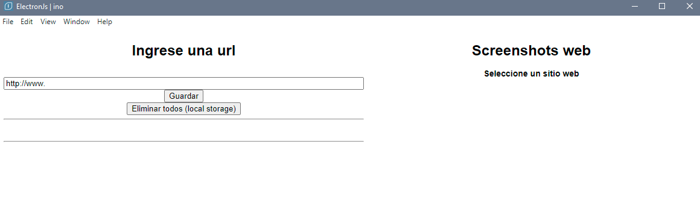
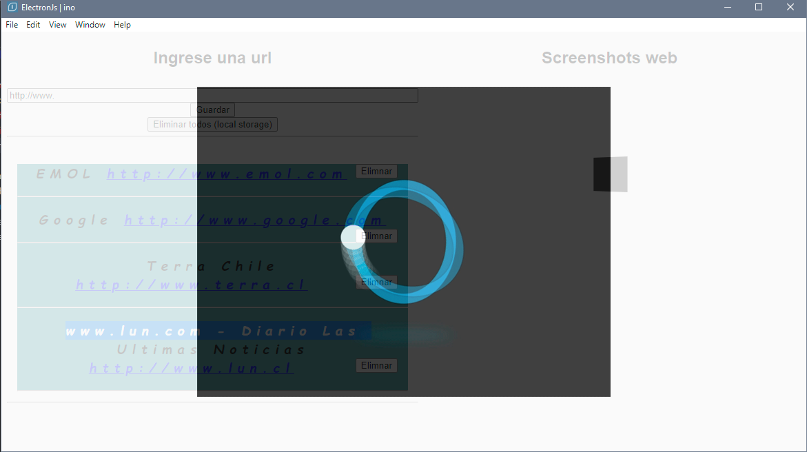
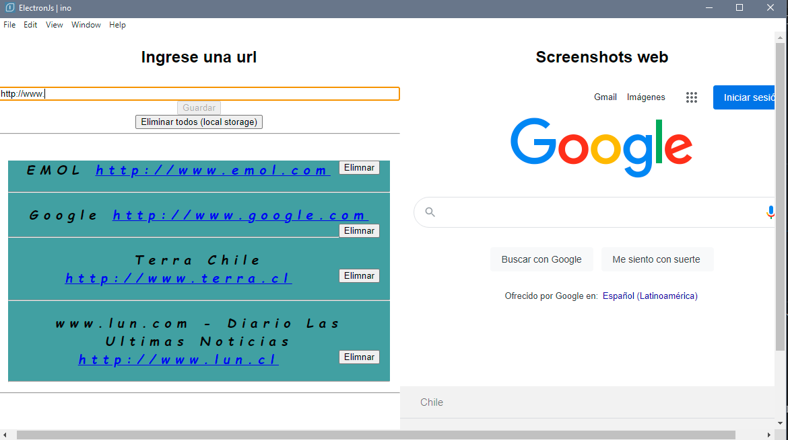
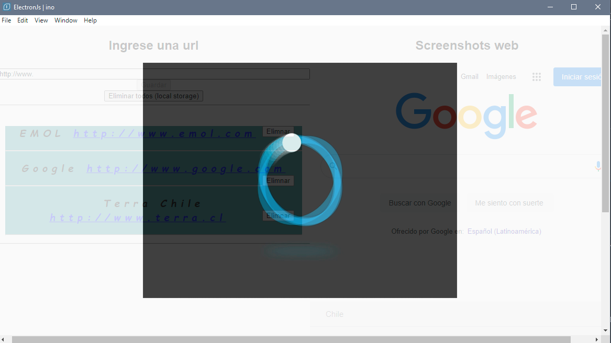

# electronjs-primera-app
app de comienzo con electronjs. 
-ingreso y validacion de url 
-add y delete de local Storage 
-ingreso y validacion de url 
-puppeteer con screenshot de url seleccionada 
-abre url en navegador y no en ventana de app 
-fetch, await, get esquelo html 
-loading y mas... 

### Modulos
electron 
puppeteer 
url-exists 

### Screenshot 

